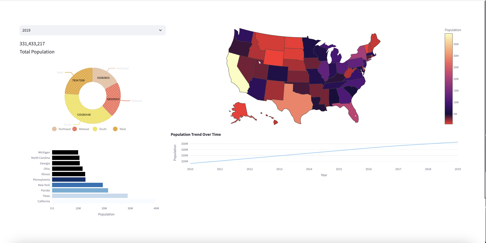

# US Population Analytics Dashboard

📊 An interactive data visualization tool for analyzing US population trends by state and region, providing insights into population distributions and historical changes. This dashboard is developed with **Streamlit** for its web interface, **Plotly** for data visualizations, and **Nivo** for enhanced chart elements.

THEME (DARK):


THEME (WHITE):


---

## Table of Contents

- [Project Description](#project-description)
- [Features](#features)
- [Technologies](#technologies)
- [Installation](#installation)
- [Usage](#usage)
- [Code Structure](#code-structure)
- [Challenges](#challenges)
- [Future Enhancements](#future-enhancements)
---

## Project Description

This dashboard visualizes US population data from 2010 to 2019, allowing users to explore demographic insights across states and regions. With options for light and dark themes, interactive tooltips, and a variety of charts, users can easily navigate and analyze population trends and distributions.

## Features

- **State and Region Filtering**: Select data by year and display total population, along with regional breakdowns.
- **Population Visualizations**:
  - **Pie Chart**: Shows population distribution by region.
  - **Top 10 States Bar Chart**: Displays the states with the largest populations.
  - **Choropleth Map**: Depicts population density across states.
  - **Trend Line**: Illustrates population growth over time.
- **Dark and Light Modes**: Toggle-friendly with automatic tooltip color adjustments.
- **Custom Tooltip Formatting**: Tailored tooltips that adjust colors based on the selected theme.

## Technologies

- **Streamlit**: Used for building the web application and layout.
- **Plotly**: Generates interactive charts including bar, line, and map visualizations.
- **Nivo**: Used for rendering enhanced pie charts with tooltips.
- **Pandas**: For data handling and transformation.

## Installation

1. **Clone the Repository**:
    `bash
    git clone https://github.com/C0deXG/population-dashboard.git
    cd population-dashboard
    `

2. **Install Dependencies**:
    Make sure you have Python 3.7+ and install required packages using:
    ```bash
    pip install -r requirements.txt
    ```

3. **Run the Application**:
    Launch the Streamlit app by running:
    ```bash
    streamlit run app.py
    ```

## Usage

1. Launch the application with the command above.
2. Choose a year from the dropdown menu to filter population data for that year.
3. Explore various visualizations:
   - **Pie Chart** showing the population distribution by region.
   - **Bar Chart** listing the top 10 states by population.
   - **Choropleth Map** for a visual distribution of population density.
   - **Line Chart** displaying population trends over time.
4. Switch between dark and light themes, and view customized tooltips as they adapt to the selected theme.

## Code Structure

- **`app.py`**: Main file containing Streamlit layout, visualizations, and theme customization logic.
- **Data**:
  - `data/us-population-2010-2019-reshaped.csv`: The dataset containing US population data from 2010 to 2019.
- **Functions**:
  - `theme_check()`: Configures tooltip styles based on the theme.
  - `load_data()`: Loads and caches the dataset for optimized performance.

## Challenges

- **Tooltip Color Customization**: Implementing theme-based tooltip styles required dynamic adjustments.
- **Data Formatting**: Ensuring population values are human-readable with comma separation.
- **Interactivity**: Balancing responsive interactivity with Streamlit’s constraints in rendering complex data visualizations.

## Future Enhancements

- **More Detailed Maps**: Integrate finer-grain mapping for visualizing data by county.
- **Expanded Year Range**: Include more recent data to analyze recent population trends.
- **Export Options**: Allow users to export visualizations as images or data summaries in CSV format.
---

### Data Source
Data provided by the [US Census Bureau](https://www.census.gov/).

# population-dashboard
